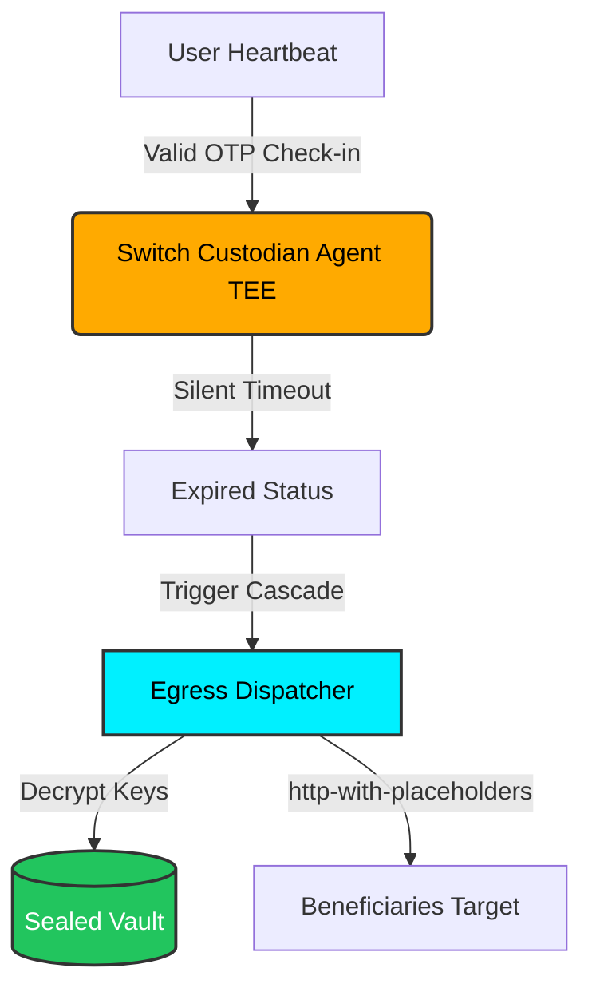

<div align="center">

  
  <h1>Epoch ⏳</h1>
  <p><em>Verifiable, privacy-blind inheritance and continuity orchestration inside hardware-isolated enclaves.</em></p>
  

  <br/>

  [](https://epoch.edycu.dev)
  [](https://youtu.be/your-video)
  [](https://epoch.edycu.dev/pitch-deck.html)
  [](https://dorahacks.io/hackathon/t3adkdevchallenge)

  <br/>

  
  
  
  
  [](https://github.com/edycutjong/epoch/actions/workflows/ci.yml)

</div>

---

## 📸 See it in Action

<div align="center">
  
</div>

> **Arm switch** → **Pulse heartbeats inside TDX Enclave** → **Countdown triggers blind legacy cascade** if check-in goes silent.

---

## 💡 The Problem & Solution

After a serious medical diagnosis or for secure institutional continuity, users need a way to pass on secrets (credentials, private keys, final instructions) to heirs if they become unresponsive. However, handing over a complete digital life to a centralized custodian or tech startup today is a privacy nightmare.

**Epoch** solves this by leveraging a TEE-secured dead-man's switch running inside **Intel TDX enclaves**. Secrets remain fully sealed and encrypted until the countdown condition expires. Heartbeats are verified with TOTP OTP codes inside the enclave, and beneficiaries are reached at the edge using privacy-blind egress channels.

### Key Features:
- 🛡️ **Intel TDX Hardware Enclaves**: Host-isolated boundary ensures that no host admin or cloud provider can access the sealed vault files or decryption keys before expiry.
- ⚡ **Atomic Cascade Rollbacks**: Downstream legacy release executes as a single transactional unit; reverts and rolls back fully if any downstream target fails.
- 🔒 **Privacy-Blind Egress**: Substitutes PII markers (e.g. `{{profile.email}}`) at the egress boundary using `http-with-placeholders`, so the enclave never leaks contact details.
- 🕰️ **Monotonic Clock Guard**: Hardened liveness checks rely on the enclave's secure monotonic clock, making countdowns immune to host clock tampering.

---

## 🏗️ Architecture & Tech Stack

| Layer | Technology |
|---|---|
| **Frontend UI** | Next.js 16 (App Router), React 19, Tailwind CSS |
| **Secure Enclave** | Intel TDX TEE |
| **Contract / Core Logic** | Rust compiled to WebAssembly (`wasm32-unknown-unknown`) |
| **Integrations** | Terminal 3 ADK Host APIs (KV Store, Clock, HTTP with Placeholders, VC Signing) |
| **E2E Testing** | Playwright |
| **Performance Audit** | Lighthouse CI |

### Enclave Egress Flow:


---

## 🏆 Sponsor Tracks Targeted

### T3 ADK Developer Track
- **kv-store API**: Sealed storage of user switch configuration and encrypted vault keys. (Implemented in Wasm contract imports `host_kv_store_get` and `host_kv_store_set` in [contract/src/lib.rs:L86-110](contract/src/lib.rs#L86-110)).
- **clock API**: Monotonic clock usage for countdown duration evaluation, preventing tampering. (Used via `host_clock_now` in [contract/src/lib.rs:L112-114](contract/src/lib.rs#L112-114)).
- **http-with-placeholders API**: Secure egress alerts to beneficiaries replacing did profile PII markers. (Used via `host_http_with_placeholders_post` in [contract/src/lib.rs:L482-488](contract/src/lib.rs#L482-488)).
- **signing API**: Issuance of a Verifiable Credential receipt verifying the success/failure of the atomic legacy cascade. (Used via `host_signing_issue_vc` in [contract/src/lib.rs:L516-520](contract/src/lib.rs#L516-520)).
- **stash API**: Sealed storage of user documents and files. (Used via `host_stash_put` and `host_stash_get` in [contract/src/lib.rs:L120-150](contract/src/lib.rs#L120-150)).


---

## 🚀 Getting Started

### Prerequisites
- Node.js ≥ 20
- Rust Toolchain with `wasm32-unknown-unknown` target:
  ```bash
  rustup target add wasm32-unknown-unknown
  ```

### Installation & Local Setup

1. **Clone the repository:**
   ```bash
   git clone https://github.com/edycutjong/epoch.git
   cd epoch
   ```

2. **Install dependencies:**
   ```bash
   npm install
   ```

3. **Compile the WASM Contract:**
   ```bash
   cd contract
   cargo build --target wasm32-unknown-unknown --release
   cd ..
   mkdir -p src/lib
   cp contract/target/wasm32-unknown-unknown/release/epoch_contract.wasm src/lib/
   ```

4. **Setup Environment:**
   ```bash
   cp .env.example .env
   ```

5. **Run Development Server:**
   ```bash
   npm run dev
   ```

---

## 🧪 Testing & CI

We enforce a **6-stage pipeline**: Quality → Security → Build → E2E → Performance → Deploy.

```bash
# ── Local Automation ────────────────────────
make e2e           # Run Playwright E2E tests
make lighthouse    # Run Lighthouse CI performance audit
make security-scan # Run high/critical security scan

# ── Code Quality ────────────────────────────
npm run lint       # Lint check
npm run typecheck  # TypeScript compiler check
npm run test       # Run unit tests
```

| Layer | Tool | Status |
|---|---|---|
| Code Quality | ESLint + TypeScript | ✅ Passed |
| Unit Testing | Jest (100% coverage) | ✅ Passed |
| E2E Testing | Playwright (3 suites) | ✅ Passed |
| Security (SAST) | CodeQL | ✅ Active |
| Security (SCA) | Dependabot + npm audit | ✅ Clean |
| Secret Scanning | TruffleHog | ✅ Configured |
| Performance | Lighthouse CI | ✅ Configured |

---

## 📁 Project Structure

```
epoch/
├── docs/              # README and presentation assets
│   ├── assets/
│   │   ├── screenshots/  # Walkthrough screenshots (01 to 08)
│   │   └── icon-512.png
│   ├── readme-hero.png
│   └── PITCH_DECK.md
├── src/
│   ├── app/           # Next.js 16 App Router Pages
│   ├── components/    # React 19 Components
│   └── lib/           # Enclave WASM & Client API Wrappers
├── contract/          # Rust/WASM TEE Contract Source
├── e2e/                # Playwright E2E Tests
├── test/               # Vitest Integration Tests
├── .github/           # GitHub Actions CI Workflows
├── eslint.config.mjs  # ESLint 9 configuration
├── Makefile           # Local Automation Targets
├── lighthouserc.json  # Lighthouse CI audit config
└── README.md          # You are here
```

---

## 🧠 Terminal 3 ADK Dev Challenge: Audit & Discovered Bugs

This project is submitted to the **Terminal 3 ADK Dev Challenge 2026** as part of the **Vouch Suite** (a 5-enclave system including Epoch, Lethe, Silo, Synod, and Visor).

During the development and integration of these enclaves, we completed a thorough audit of the Terminal 3 Agent Dev Kit (ADK) host APIs and SDK, identifying **six concrete onboarding bugs and documentation gaps** that we have compiled for the dev challenge judges:

1. **Bug #1: Undocumented Parameter in `metamask_sign`:** The SDK setup instructions specify `EthSign: metamask_sign(address, undefined, T3N_API_KEY)` without documenting what the second parameter (passed as `undefined`) does or configures, creating blocker questions for custom wallet bindings.
2. **Bug #2: `kv-store` Interface Discrepancy (Map Name vs. Flat Keys):** The official WIT file (`package.wit`) declares KV operations as `get: func(map-name: string, key: list<u8>)`. However, the raw C imports and local runtimes assume a single flat namespace where `host_kv_store_get` only takes `key_ptr` and `key_len` parameters. This makes it impossible to build WASM Component-compliant code without renaming/wrapping guest imports.
3. **Bug #3: Clock API Method Name Mismatch:** Walkthroughs reference `fn host_clock_now() -> u64`, but the dependency WIT packages require `now-ms: func() -> result<u64, clock-error>`. This causes cargo compilation errors when targeting standard `wasm32-wasip2` components.
4. **Bug #4: Missing `host_signing_issue_vc` in `signing` WIT Interface:** The non-WIT templates call `host_signing_issue_vc` to sign and issue Verifiable Credentials. However, the official WIT `signing` interface only exposes `sign: func(message: list<u8>) -> result<list<u8>, sign-error>`, with no VC-level helper functions.
5. **Gap #5: Opaque `loadWasmComponent` Path Resolution:** The setup guides invoke `await loadWasmComponent()` with zero arguments, but do not document where the `.wasm` component files are resolved from, or how developers can override the path for local components.
6. **Gap #6: Tenant DID Hex Double-Encoding Trap:** The developer cheatsheet suggests map names are resolved via `format!("z:{}:secrets", hex::encode(&tid))` where `tid` is `tenant_did()`. If `tenant_did()` returns a string (e.g. `did:t3n:f600...`), `hex::encode` will double-encode the ASCII representation, breaking KV routing.
7. **Gap #7: Public KV Route specifications:** The guides mention that public maps are world-readable via `/api/dev/public-kv/<tid>/<tail>`. However, there is no documentation on CORS policies, cache-control headers, or pagination query schemas.
8. **Gap #8: Transaction Rollback Semantics Undocumented:** The documentation lacks explanation on how to trigger state rollbacks programmatically when a contract function returns an `Err`.
9. **Gap #9: Outbox Idempotency Lifecycles:** The `outbox` interface enqueues webhooks using an `idk` (idempotency key), but details about the deduplication window lifespan and queue overflow behaviors are undocumented.

---

## 📄 License

[MIT](LICENSE) © 2026 Edy Cu

---

## 🙏 Acknowledgments

Built for the DoraHacks T3ADK Launch Edition 2026. Thank you to the Terminal 3 team for the enclaves environment and development tools.
