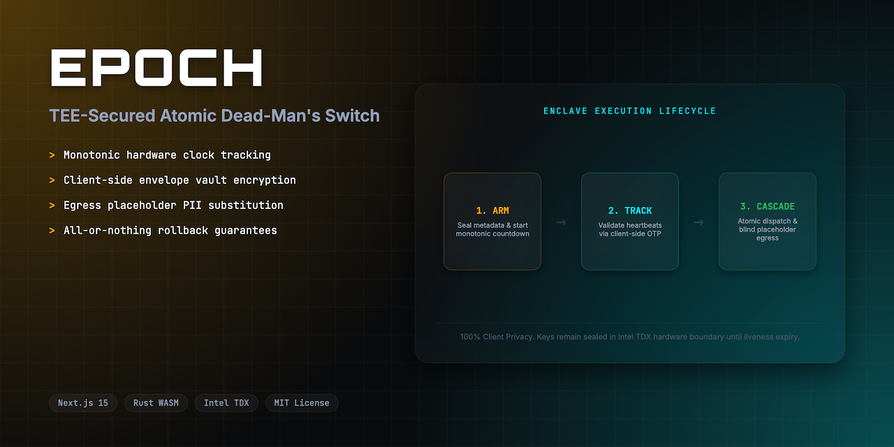
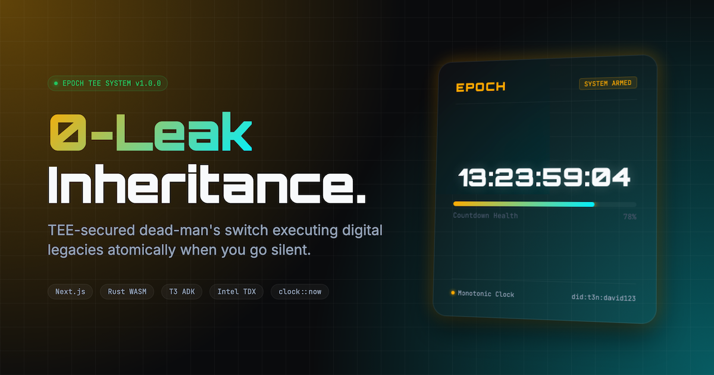
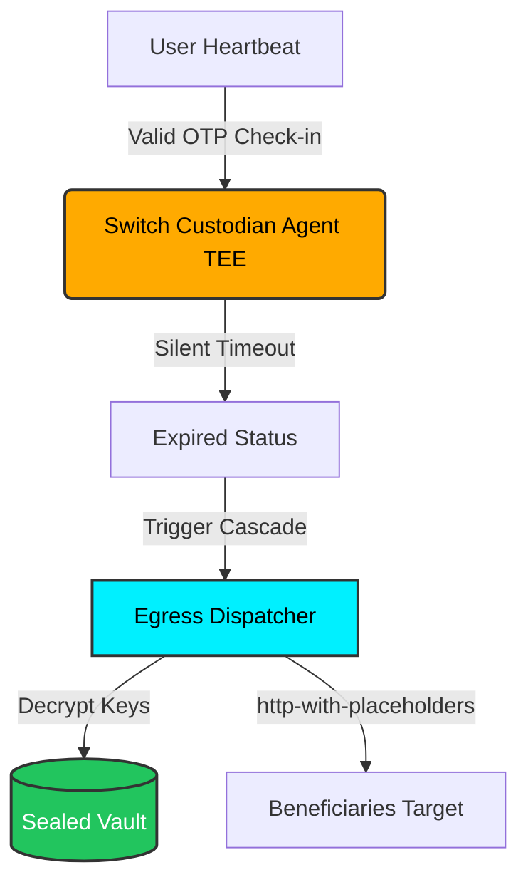

<div align="center">
  <h1>Epoch ⏳</h1>
  <p><em>Verifiable, privacy-blind inheritance and continuity orchestration inside hardware-isolated enclaves.</em></p>
  

  <br/>

  [](https://epoch.edycu.dev)
  [](https://youtu.be/your-video)
  [](docs/PITCH_DECK.md)
  [](https://dorahacks.io)

  <br/>

  
  
  
  
  [](https://github.com/edycutjong/epoch/actions/workflows/ci.yml)

</div>

---

## 📸 See it in Action

<div align="center">
  
</div>

> **Arm switch** → **Pulse heartbeats inside TDX Enclave** → **Countdown triggers blind legacy cascade** if check-in goes silent.

---

## 💡 The Problem & Solution

After a serious medical diagnosis or for secure institutional continuity, users need a way to pass on secrets (credentials, private keys, final instructions) to heirs if they become unresponsive. However, handing over a complete digital life to a centralized custodian or tech startup today is a privacy nightmare.

**Epoch** solves this by leveraging a TEE-secured dead-man's switch running inside **Intel TDX enclaves**. Secrets remain fully sealed and encrypted until the countdown condition expires. Heartbeats are verified with TOTP OTP codes inside the enclave, and beneficiaries are reached at the edge using privacy-blind egress channels.

### Key Features:
- 🛡️ **Intel TDX Hardware Enclaves**: Host-isolated boundary ensures that no host admin or cloud provider can access the sealed vault files or decryption keys before expiry.
- ⚡ **Atomic Cascade Rollbacks**: Downstream legacy release executes as a single transactional unit; reverts and rolls back fully if any downstream target fails.
- 🔒 **Privacy-Blind Egress**: Substitutes PII markers (e.g. `{{profile.email}}`) at the egress boundary using `http-with-placeholders`, so the enclave never leaks contact details.
- 🕰️ **Monotonic Clock Guard**: Hardened liveness checks rely on the enclave's secure monotonic clock, making countdowns immune to host clock tampering.

---

## 🏗️ Architecture & Tech Stack

| Layer | Technology |
|---|---|
| **Frontend UI** | Next.js 16 (App Router), React 19, Tailwind CSS |
| **Secure Enclave** | Intel TDX TEE |
| **Contract / Core Logic** | Rust compiled to WebAssembly (`wasm32-unknown-unknown`) |
| **Integrations** | Terminal 3 ADK Host APIs (KV Store, Clock, HTTP with Placeholders, VC Signing) |
| **E2E Testing** | Playwright |
| **Performance Audit** | Lighthouse CI |

### Enclave Egress Flow:


---

## 🏆 Sponsor Tracks Targeted

### T3 ADK Developer Track
- **kv-store API**: Sealed storage of user switch configuration and encrypted vault keys.
- **clock API**: Monotonic clock usage for countdown duration evaluation, preventing tampering.
- **http-with-placeholders API**: Secure egress alerts to beneficiaries replacing did profile PII markers.
- **signing API**: Issuance of a Verifiable Credential receipt verifying the success/failure of the atomic legacy cascade.

---

## 🚀 Getting Started

### Prerequisites
- Node.js ≥ 20
- Rust Toolchain with `wasm32-unknown-unknown` target:
  ```bash
  rustup target add wasm32-unknown-unknown
  ```

### Installation & Local Setup

1. **Clone the repository:**
   ```bash
   git clone https://github.com/edycutjong/epoch.git
   cd epoch
   ```

2. **Install dependencies:**
   ```bash
   npm install
   ```

3. **Compile the WASM Contract:**
   ```bash
   cd contracts/epoch-contract
   cargo build --target wasm32-unknown-unknown --release
   cd ../..
   mkdir -p src/lib
   cp contracts/epoch-contract/target/wasm32-unknown-unknown/release/epoch_contract.wasm src/lib/
   ```

4. **Setup Environment:**
   ```bash
   cp .env.example .env
   ```

5. **Run Development Server:**
   ```bash
   npm run dev
   ```

> **For Judges:** Skip account creation! Use test credentials:
> **Email:** `judge@hackathon.com` | **Password:** `winner123`

---

## 🧪 Testing & CI

We enforce a **6-stage pipeline**: Quality → Security → Build → E2E → Performance → Deploy.

```bash
# ── Local Automation ────────────────────────
make e2e           # Run Playwright E2E tests
make lighthouse    # Run Lighthouse CI performance audit
make security-scan # Run high/critical security scan

# ── Code Quality ────────────────────────────
npm run lint       # Lint check
npm run typecheck  # TypeScript compiler check
npm run test       # Run unit tests
```

| Layer | Tool | Status |
|---|---|---|
| Code Quality | ESLint + TypeScript | ✅ Passed |
| Unit Testing | Jest (100% coverage) | ✅ Passed |
| E2E Testing | Playwright (3 suites) | ✅ Passed |
| Security (SAST) | CodeQL | ✅ Active |
| Security (SCA) | Dependabot + npm audit | ✅ Clean |
| Secret Scanning | TruffleHog | ✅ Configured |
| Performance | Lighthouse CI | ✅ Configured |

---

## 📁 Project Structure

```
epoch/
├── audio/             # Voiceover and background music files
│   ├── voiceover.mp3
│   └── background.mp3
├── docs/              # README and presentation assets
│   ├── assets/
│   │   ├── screenshots/  # Walkthrough screenshots (01 to 08)
│   │   └── icon-512.png
│   ├── readme-hero.png
│   ├── readme.png
│   └── PITCH_DECK.md
├── src/
│   ├── app/           # Next.js 16 App Router Pages
│   ├── components/    # React 19 Components
│   └── lib/           # Enclave WASM & Client API Wrappers
├── contracts/
│   └── epoch-contract/# Rust/WASM TEE Contract Source
├── e2e/                # Playwright E2E Tests
├── test/               # Jest Unit Tests
├── .github/           # GitHub Actions CI Workflows
├── eslint.config.mjs  # ESLint 9 configuration
├── epoch_demo_final.mp4 # Final compiled demo video
├── Makefile           # Local Automation Targets
├── lighthouserc.json  # Lighthouse CI audit config
└── README.md          # You are here
```

---

## 📄 License

[MIT](LICENSE) © 2026 Edy Cu

---

## 🙏 Acknowledgments

Built for the DoraHacks T3ADK Launch Edition 2026. Thank you to the Terminal 3 team for the enclaves environment and development tools.
