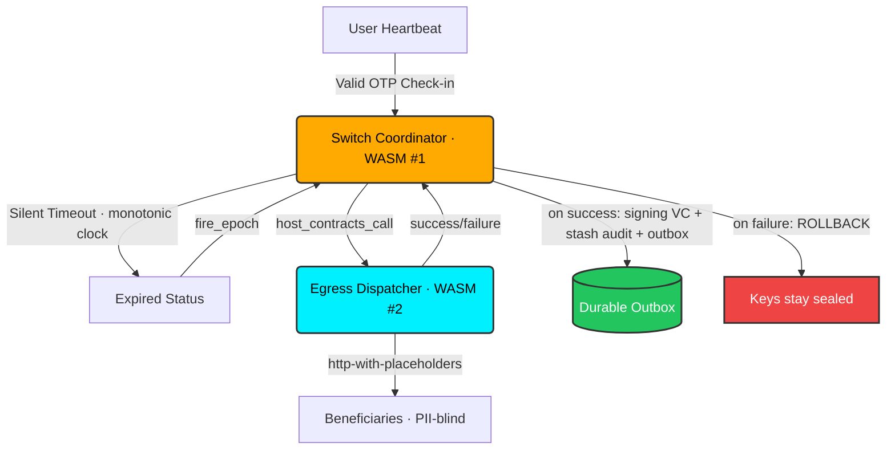

<div align="center">

  
  <h1>Epoch ⏳</h1>
  <p><em>Verifiable, privacy-blind inheritance and continuity orchestration inside hardware-isolated enclaves.</em></p>
  

  <br/>

  [](https://epoch.edycu.dev)
  [](https://youtu.be/your-video)
  [](https://epoch.edycu.dev/pitch-deck.html)
  [](https://dorahacks.io/hackathon/t3adkdevchallenge)

  <br/>

  
  
  
  
  
  
  [](https://github.com/edycutjong/epoch/actions/workflows/ci.yml)

</div>

---

> ⚡ **Reviewers / judges:** fastest path is **[GOLDEN_PATH.md](docs/GOLDEN_PATH.md)** — the entire flow in ~2 minutes, **no credentials**. Bug-bounty track: **[SDK_AUDIT.md](docs/SDK_AUDIT.md)** (confirmed, code-cited findings from the real `@terminal3` SDK).

## 📸 See it in Action

<div align="center">
  
</div>

> **Arm switch** → **Pulse heartbeats inside TDX Enclave** → **Countdown triggers blind legacy cascade** if check-in goes silent.

---

## 💡 The Problem & Solution

After a serious medical diagnosis or for secure institutional continuity, users need a way to pass on secrets (credentials, private keys, final instructions) to heirs if they become unresponsive. However, handing over a complete digital life to a centralized custodian or tech startup today is a privacy nightmare.

**Epoch** solves this by leveraging a TEE-secured dead-man's switch running inside **Intel TDX enclaves**. Secrets remain fully sealed and encrypted until the countdown condition expires. Heartbeats are verified with TOTP OTP codes inside the enclave, and beneficiaries are reached at the edge using privacy-blind egress channels.

### Key Features:
- 🛡️ **Intel TDX Hardware Enclaves**: Host-isolated boundary ensures that no host admin or cloud provider can access the sealed vault files or decryption keys before expiry.
- ⚡ **Atomic Cascade Rollbacks**: Downstream legacy release executes as a single transactional unit; reverts and rolls back fully if any downstream target fails.
- 🔒 **Privacy-Blind Egress**: Substitutes PII markers (e.g. `{{profile.email}}`) at the egress boundary using `http-with-placeholders`, so the enclave never leaks contact details.
- 🕰️ **Monotonic Clock Guard**: Hardened liveness checks rely on the enclave's secure monotonic clock, making countdowns immune to host clock tampering.

---

## 🏗️ Architecture & Tech Stack

| Layer | Technology |
|---|---|
| **Frontend UI** | Next.js 16 (App Router), React 19, Tailwind CSS |
| **Secure Enclave** | Intel TDX TEE |
| **Contract / Core Logic** | **Two** Rust→WASM enclave contracts (`wasm32-unknown-unknown`): the **Switch Coordinator** (`contract/`) and the **Egress Dispatcher** (`contract-executor/`) |
| **Integrations** | 8 Terminal 3 ADK Host APIs — `kv-store`, `clock`, `signing`, `stash`, `logging`, `contracts-call`, `outbox`, `http-with-placeholders` |
| **E2E Testing** | Playwright |
| **Performance Audit** | Lighthouse CI + `scripts/bench.py` |

### Two-Contract Atomic Cascade:
The **Switch Coordinator** never performs egress itself. When a switch expires it invokes the **Egress Dispatcher** ("Blind Courier") synchronously via `contracts-call`. The whole release is one atomic transaction: if the Dispatcher reports any failed delivery, the Coordinator aborts — the switch is **not** marked fired, **no** VC is issued, and **nothing** is enqueued to the durable outbox, so the vault keys stay sealed.



---

## 🏆 Sponsor Tracks Targeted

### T3 ADK Developer Track — 8 Host APIs across 2 enclave contracts

**Switch Coordinator** ([`contract/src/lib.rs`](contract/src/lib.rs)):
- **`kv-store`**: Sealed storage of switch config and encrypted vault keys (`host_kv_store_get` / `host_kv_store_set`).
- **`clock`**: Monotonic countdown evaluation + TOTP time-window, immune to NTP tampering (`host_clock_now`).
- **`signing`**: Issues a W3C `LegacyReleaseCredential` VC receipt for the cascade. The host signing service uses the **real published Terminal 3 SDK** — [`@terminal3/ecdsa_vc`](https://www.npmjs.com/package/@terminal3/ecdsa_vc) to issue a genuine `EcdsaSecp256k1Signature2019` credential and [`@terminal3/verify_vc`](https://www.npmjs.com/package/@terminal3/verify_vc) to verify it (offline, no credentials — see [`src/lib/realVc.ts`](src/lib/realVc.ts), [`/api/verify-vc`](src/app/api/verify-vc/route.ts), and `test/realVc.test.ts`). A tampered VC fails verification.
- **`stash`**: Retrieves sealed vault files and uploads the release audit manifest (`host_stash_get` / `host_stash_put`).
- **`logging`**: In-enclave audit trace (`host_logging_log`).
- **`contracts-call`** ⭐: Synchronously invokes the Egress Dispatcher contract as an atomic sub-transaction (`host_contracts_call`).
- **`outbox`**: Durable, idempotent (`idk`-keyed) enqueue of the release event on success (`host_outbox_enqueue`).

**Egress Dispatcher** ([`contract-executor/src/lib.rs`](contract-executor/src/lib.rs)):
- **`http-with-placeholders`** ⭐: PII-blind beneficiary egress — substitutes `{{profile.*}}` markers at the host boundary so neither contract sees plaintext contacts (`host_http_with_placeholders_post`).
- **`logging`**: Courier-side delivery trace (`host_logging_log`).


---

## 🚀 Getting Started

### Prerequisites
- Node.js ≥ 20
- Rust Toolchain with `wasm32-unknown-unknown` target:
  ```bash
  rustup target add wasm32-unknown-unknown
  ```

### Installation & Local Setup

1. **Clone the repository:**
   ```bash
   git clone https://github.com/edycutjong/epoch.git
   cd epoch
   ```

2. **Install dependencies:**
   ```bash
   npm install
   ```

3. **Compile both WASM enclave contracts:**
   ```bash
   # Builds the Switch Coordinator + Egress Dispatcher and copies both into src/lib/
   make build-contracts
   ```
   <details><summary>…or manually</summary>

   ```bash
   cargo build --manifest-path contract/Cargo.toml --target wasm32-unknown-unknown --release
   cargo build --manifest-path contract-executor/Cargo.toml --target wasm32-unknown-unknown --release
   mkdir -p src/lib
   cp contract/target/wasm32-unknown-unknown/release/epoch_contract.wasm src/lib/
   cp contract-executor/target/wasm32-unknown-unknown/release/epoch_executor.wasm src/lib/
   ```
   </details>

4. **Setup Environment:**
   ```bash
   cp .env.example .env
   ```

5. **Run Development Server:**
   ```bash
   npm run dev
   ```

---

## 🧪 Testing & CI

We enforce a **6-stage pipeline**: Quality → Security → Build → E2E → Performance → Deploy.

```bash
# ── Local Automation ────────────────────────
make test-contract # Run Rust enclave contract unit tests (both contracts)
make e2e           # Run Playwright E2E tests
make lighthouse    # Run Lighthouse CI performance audit
make security-scan # Run high/critical security scan

# ── Code Quality ────────────────────────────
npm run lint       # Lint check
npm run typecheck  # TypeScript compiler check
npm run test       # Run unit tests (Vitest)

# ── Performance ─────────────────────────────
npm run dev &              # start the app
python3 scripts/bench.py   # measure p50/p95 latency (stdlib only)
```

| Layer | Tool | Status |
|---|---|---|
| Code Quality | ESLint + TypeScript | ✅ Passed |
| Unit Testing (TS) | Vitest — **193 tests** | ✅ Passed |
| Contract Testing (Rust) | cargo — **26 tests** (20 Coordinator + 6 Dispatcher) | ✅ Passed |
| E2E Testing | Playwright (3 suites) | ✅ Passed |
| Security (SAST) | CodeQL | ✅ Active |
| Security (SCA) | Dependabot + npm audit | ✅ Clean |
| Secret Scanning | TruffleHog | ✅ Configured |
| Performance | Lighthouse CI + `bench.py` | ✅ Configured |

### ⚡ Runtime Latency (local sandbox)

Measured with `scripts/bench.py` (100 iterations + 10 warmup) against `npm run dev` on Apple Silicon. Representative numbers — re-run to reproduce:

| Path | p50 | p95 | p99 |
|---|---|---|---|
| `get_status` (WASM) | 4.1 ms | 10.8 ms | 11.9 ms |
| `check_trigger` (WASM) | 3.8 ms | 5.9 ms | 13.5 ms |
| `integrations/verify` (host) | 2.7 ms | 4.9 ms | 5.8 ms |
| **`arm + expire + fire` cascade** | **15.5 ms** | **22.0 ms** | **26.6 ms** |

> The full-cascade row exercises the real path: a synchronous **`contracts-call`** into the Egress Dispatcher contract, **`http-with-placeholders`** egress, **`signing`** VC issuance, a **`stash`** audit upload, and a durable **`outbox`** enqueue — all as one atomic transaction.

---

## 📁 Project Structure

```
epoch/
├── docs/              # README and presentation assets
│   ├── assets/
│   │   ├── screenshots/  # Walkthrough screenshots (01 to 08)
│   │   └── icon-512.png
│   ├── readme-hero.png
│   └── PITCH_DECK.md
├── src/
│   ├── app/           # Next.js 16 App Router Pages
│   ├── components/    # React 19 Components
│   └── lib/           # Compiled enclave WASM (x2) & Client API Wrappers
├── contract/          # Switch Coordinator — Rust/WASM TEE contract (#1)
├── contract-executor/ # Egress Dispatcher — Rust/WASM TEE contract (#2)
├── e2e/                # Playwright E2E Tests
├── test/               # Vitest Integration Tests
├── scripts/            # seed.py, bench.py, submission checks
├── .github/           # GitHub Actions CI Workflows
├── BUGS.md            # T3 ADK bug/gap audit (Track 2)
├── eslint.config.mjs  # ESLint 9 configuration
├── Makefile           # Local Automation Targets
├── lighthouserc.json  # Lighthouse CI audit config
└── README.md          # You are here
```

---

## 🧠 Terminal 3 ADK Dev Challenge: Audit & Discovered Bugs

This project is submitted to the **Terminal 3 ADK Dev Challenge 2026** as part of the **Vouch Suite** (a 5-enclave system including Epoch, Lethe, Silo, Synod, and Visor).

While building these enclaves we audited the T3 ADK host APIs and SDK and documented **9 concrete onboarding bugs and documentation gaps** — each with a repro, impact, and the workaround we shipped — for the **Track 2 bug bounty**.

➡️ **See [BUGS.md](BUGS.md)** for the full audit. Highlights:

- **Bug #2 — `kv-store` interface discrepancy:** WIT declares `get(map-name, key)` but the C ABI is flat `(key_ptr, key_len)`.
- **Bug #3 — `clock` name mismatch:** docs say `host_clock_now() -> u64`; WIT requires `now-ms() -> result<u64, clock-error>`.
- **Bug #4 — `signing` has no VC helper:** templates call `host_signing_issue_vc`, but WIT only exposes raw `sign`.
- **Gap #6 — tenant DID hex double-encoding** silently breaks KV routing.
- **Gap #8 / #9 — rollback boundary & `outbox` idempotency window** are unspecified — both directly affect Epoch's atomic cascade.

---

## 📄 License

[MIT](LICENSE) © 2026 Edy Cu

---

## 🙏 Acknowledgments

Built for the DoraHacks T3ADK Launch Edition 2026. Thank you to the Terminal 3 team for the enclaves environment and development tools.
