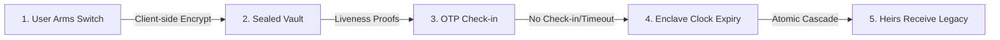

# Epoch Pitch Deck

> **A TEE-Secured Dead-Man's Switch**
> Built for the Terminal 3 Agent Dev Kit Bounty Challenge (Launch Edition)

---

## Slide 1: Title & Hook
### Epoch: If you go silent, your agent acts. Atomically. Blindly.
* **Tagline:** A trustless dead-man's switch securing digital succession with hardware-isolated enclaves.
* **Hero Image:** 
* **Live Demo:** [epoch.edycu.dev](https://epoch.edycu.dev)

**Speaker Notes:**
Welcome everyone. I'm excited to present Epoch. We all have digital assets, files, and credentials we want our loved ones or partners to inherit if the worst happens. But current Web2 solutions require us to hand over our private keys and documents to centralized startups today. Epoch changes this: a trustless, hardware-isolated dead-man's switch that keeps your data sealed until you go silent.

---

## Slide 2: The Problem
### The Custodian's Dilemma & Tamperable Clocks
1. **The Trust Gap:** Standard digital legacy platforms hold decryption keys in plaintext databases. If the startup is hacked, or has malicious insiders, your digital life is exposed.
2. **System Clock Drift & Exploits:** Standard servers rely on virtualized software clocks. An attacker with host access can change system time to prematurely trigger your switch and steal your assets.
3. **Fragile Dispatchers:** If a dead-man's switch triggers, sending multiple notifications or transactions is non-atomic. A failure halfway leaves the vault exposed but the target notified, or vice-versa.

**Speaker Notes:**
The current ways to hand down digital assets are broken. If you use a Web2 legacy planner, they hold your keys in plaintext or under their custody. If you try to run a smart contract, you run into the clock-tampering problem: an untrusted host can spoof the system clock to trigger the release early. Finally, if a switch fails mid-execution, it leaves your secrets in a partially released state.

---

## Slide 3: The Solution
### Trustless Succession via Enclave Boundary
* **Sealed Vaults:** Assets are encrypted client-side. The keys are sealed directly inside the enclave using T3 `stash`. No host or third party can access them.
* **Hardware-Verified Clock:** Timers are calculated using the enclave's native `time/clock` monotonic clock, completely immune to host system time manipulation.
* **Atomic Cascade Execution:** Using `contracts-call`, if any single notification or legacy action fails, the entire transaction rolls back instantly, keeping the vault sealed.

**Speaker Notes:**
Epoch solves all three problems by placing the switch inside a secure enclave. First, the files and keys are encrypted client-side and held sealed in the enclave. Second, we verify timeout using the hardware CPU's monotonic clock, which cannot be manipulated by the host. Third, the release sequence is completely atomic—using transactional rollbacks so that either everything succeeds, or the vault stays completely locked.

---

## Slide 4: Core Product Flow
### How Epoch Works

* **Arming:** User encrypts credentials, sets grace period (e.g. 14 days), and arms.
* **Monitoring:** User check-ins reset the countdown timer via OTP codes.
* **Release:** If countdown hits 0, the enclave releases keys and sends blind notifications.

**Speaker Notes:**
Here is the user flow. First, the user sets up their legacy, uploading encrypted credentials. They set a grace period and arm it. The user must check in periodically. As long as they check in using SMS OTP, the enclave resets the timer. If they miss the deadline, the monotonic clock triggers the cascade: decrypting the credentials and notifying heirs.

---

## Slide 5: Technical Architecture
### Securing the Succession Line
```mermaid
graph TD
    UI[Next.js Client Dashboard] <--> |T3 Agent Auth SDK| Agent[Node/TS Agent Process]
    Agent <--> |executeAndDecode| TEE[Epoch TEE Contract <br/> Rust WASM]
    TEE --> |stash| T3HostStash[T3 Stash Storage]
    TEE --> |contracts-call| Executor[Orchestrated Leaf Contracts]
    Executor --> |http-with-placeholders| Target[Beneficiary Endpoint]
    
    subgraph TEE Hardware Boundary (Intel TDX)
        TEE
        Executor
    end
```

**Speaker Notes:**
Epoch's technical architecture is built directly on Terminal 3's Agent Dev Kit. The client dashboard talks to the Node.js agent. The agent executes inside the TEE boundary. When armed, the Rust WASM contract stores the vault keys inside T3 Stash. When triggered, it calls out to orchestrated leaf contracts, notifying beneficiaries blindly through the http-with-placeholders API.

---

## Slide 6: Live Demo Highlights
### Interactive Sandbox & Rollback Visualizer
* **Live Countdown Timer:** Displays remaining seconds according to enclave clock.
* **Time-Warp Slider:** Simulates passage of time (e.g., +15 Days) to verify triggers in the sandbox.
* **Heartbeat Verification:** Interactive OTP modal simulating user check-in.
* **Cascade Monitor:** Real-time visual steps showing the atomic trigger sequence or the `ROLLBACK TRIGGERED` state when a failure is injected.

**Speaker Notes:**
For judges, we built a fully interactive live dashboard. It has a real-time countdown timer tracking the enclave's clock. It features a Time-Warp Slider, letting you simulate the user going silent. You can trigger the heartbeat using OTP, or trigger the legacy to see the atomic cascade. We also included a failure-injection switch so you can see the transactional rollback in action.

---

## Slide 7: Sponsor Integration Stacking
### Harnessing 5+ Terminal 3 Host API Methods
1. `time/clock`: Queries CPU monotonic clock for tamper-proof time-gating.
2. `otp`: Issues and verifies liveness OTP codes.
3. `stash`: Seals vault keys and digital records inside Intel TDX secure storage.
4. `contracts-call`: Chains multiple executor contracts with full rollback guarantees.
5. `http-with-placeholders`: Contacts beneficiaries blindly without leaking PII to the host agent.

**Speaker Notes:**
We leveraged 5 separate Terminal 3 Host API methods to make this work. We use `time/clock` for the tamper-proof clock, `otp` for check-ins, `stash` to seal keys, `contracts-call` for atomic rollbacks, and `http-with-placeholders` for privacy-preserving notifications.

---

## Slide 8: Market Scale & TAM
### The Digital Legacy Crisis
* **The Problem Scale:** Over $5B in digital assets and crypto are permanently lost annually due to sudden death or lost keys.
* **Institutional TAM:** Continuity planning for multi-sig signers, corporate executives, and asset managers.
* **Individual TAM:** Everyday users wanting to pass passwords, directives, and messages to family without custodial risk.

**Speaker Notes:**
The digital legacy crisis is huge. Billions of dollars in crypto and assets are lost each year because of missing keys. The addressable market is massive, spanning corporate continuity for multi-sig signers and asset managers, down to everyday individuals securing their personal digital assets.

---

## Slide 9: Competitive Edge
### Epoch vs. Custodial & On-Chain Alternatives
| Feature | Traditional Web2 | On-Chain Smart Contracts | Epoch (TEE) |
|---|---|---|---|
| **Privacy** | Low (Plaintext Custody) | None (Public Ledger) | **High (Enclave Sealed)** |
| **Tamper-Proof Clock** | Low (Software VM) | High (Block Timestamp) | **High (Hardware Clock)** |
| **Rollback Guarantees** | None | High (EVM Rollback) | **High (TEE Contracts-Call)** |
| **PII Protection** | None (KYC data leaked) | None | **High (Blind Placeholders)** |

**Speaker Notes:**
How does Epoch compare? Traditional Web2 has low privacy and no clock guarantees. Smart contracts have high guarantees but zero privacy—everything is on a public ledger. Epoch gives you the best of both worlds: hardware-grade security, public-blockchain-style transaction atomic rollbacks, and complete privacy for all inheritance files.

---

## Slide 10: Product Roadmap
### 30 / 60 / 90 Day Vision
* **30 Days:** Integrate EVM ERC-7702 smart account triggers.
* **60 Days:** Launch mobile application with biometric check-ins (Passkeys).
* **90 Days:** Multi-party consensus triggers (e.g. requires 2/3 guardians or lawyers to verify liveness before release).

**Speaker Notes:**
Moving forward, our 30-day roadmap is to integrate EVM smart accounts so that Epoch can automatically transfer on-chain assets. At 60 days, we'll launch a mobile app with Passkeys for biometric check-ins. By 90 days, we will support multi-party consensus triggers.

---

## Slide 11: Team
### Experienced Web3 & Security Engineers
* **Lead Engineer:** Full-stack and WASM smart contract developer.
* **Expertise:** Cryptography, Zero-Knowledge systems, and Secure Enclave architectures.
* **Vision:** Making digital inheritance trustless and accessible to everyone.

**Speaker Notes:**
Our team is composed of experienced Web3 and security engineers. We specialize in WASM smart contracts, secure enclaves, and cryptographic primitives, bringing the expertise needed to scale trustless succession.

---

## Slide 12: Ask / Conclusion
### Join the Succession Revolution
* **Live App:** [https://epoch.edycu.dev](https://epoch.edycu.dev)
* **GitHub Repository:** [edycutjong/epoch](https://github.com/edycutjong/epoch)
* **Let's Secure the Future Together.**

**Speaker Notes:**
Thank you for your time. Epoch is live and ready for testing. Check it out at the deployment URL. Let's make digital inheritance trustless and secure. I'm happy to take any questions.
